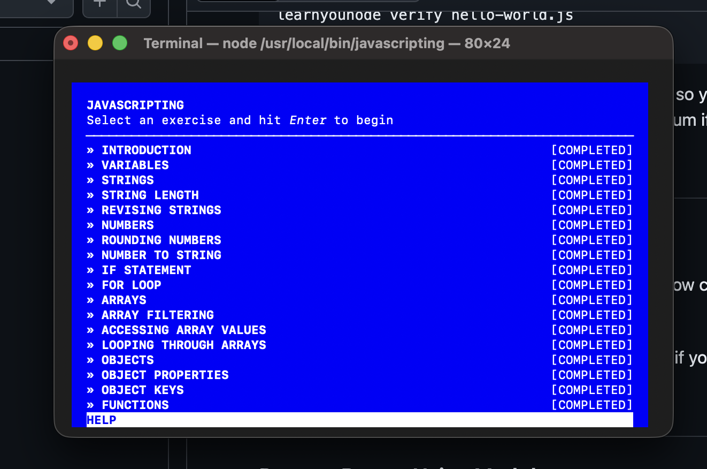
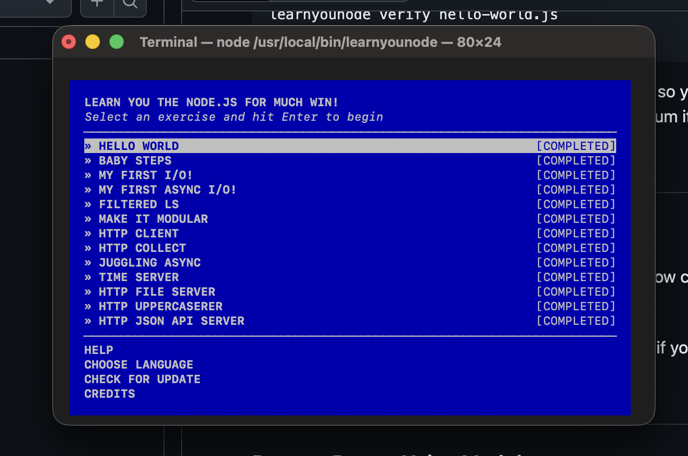

# Assignment Submission

## Description
This repository contains my submission for the **CS533 Assignment**.  
The work includes practice with the following **Node.js-based workshoppers**:
- **learnyouhtml** – Introduction to HTML fundamentals
- **javascripting** – JavaScript basics and core concepts
- **learnyounode** – Node.js fundamentals

The repo is organized into the following structure:
```text
assignments/
└── Denisov/
 ├── 1/
 │ └── html/ # Solutions for learnyouhtml
 │ └── javascripting/ # Solutions for javascripting
 | └── node/ # Solutions for learnyounode
README.md
```

Each directory contains my solutions, along with necessary files for verification.

---

## Files Included
- `assignments/Denisov/1/html/` → HTML exercise solutions  
- `assignments/Denisov/1/js/` → JavaScript exercise solutions  
- `assignments/Denisov/1/node/` → Node.js exercise solutions  
- `README.md` → Documentation with details, screenshots, and video link  

---

## Screenshots

### learnyouhtml Completion


### javascripting Completion


### learnyounode Completion


---

## Video Demonstration

👉 [Watch the video on YouTube](https://youtu.be/00bRehND9uU

---

