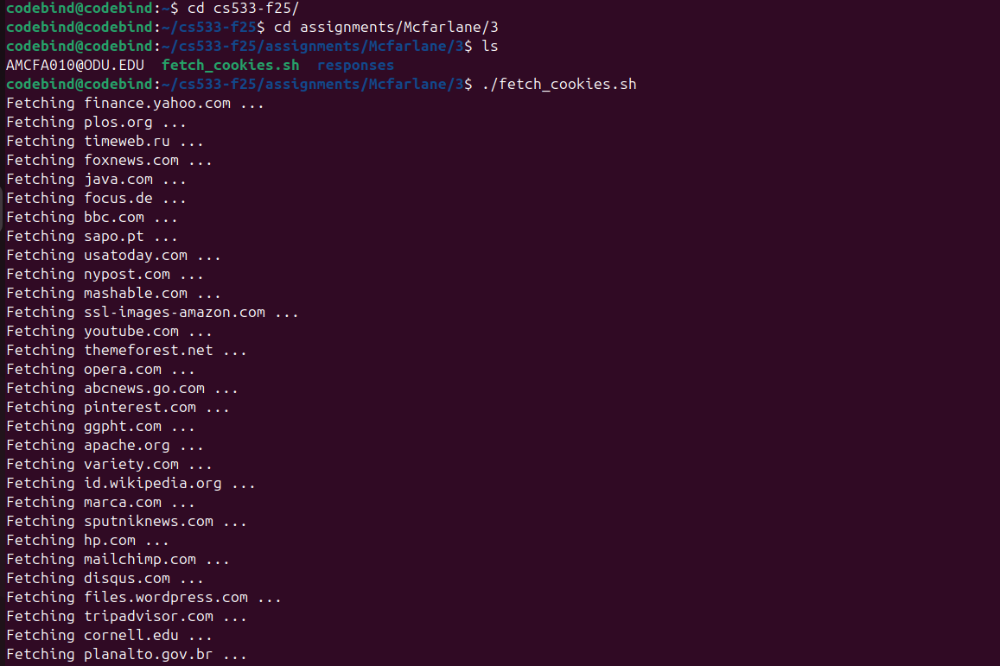
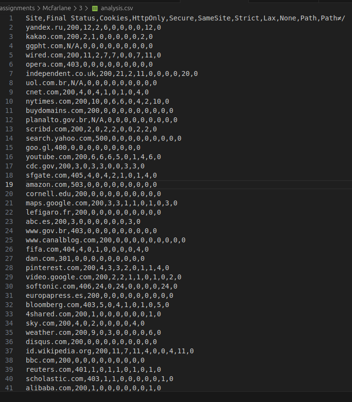

# Assignment 3 - Cookie Report  
**CS 433/533 Web Security - Fall 2024**  
**Due:** October 5, 2025  
**Points:** 15 + 2 (Extra Credit)  
**Student:** *Anthony McFarlane*  

---

## Overview

This project analyzes cookie practices for **100 randomly assigned websites** from Mozilla’s Top 500 list.  
The objective was to:

- Retrieve HTTP response headers for each site.
- Parse and analyze all `Set-Cookie` headers.
- Report the **final HTTP status code** (not intermediate 301/302 redirects).
- Count how many cookies include attributes such as:
  - `HttpOnly`
  - `Secure`
  - `SameSite` (and its policy: `Strict`, `Lax`, or `None`)
  - `Path` (and whether it differs from `/`)

All results are summarized below in a Markdown table, and overall statistics are calculated from the collected data.

---

## Helper Scripts

### `fetch_cookies.sh`
This **Bash script** automates the process of fetching HTTP response headers for the assigned 100 websites.

- It loops through a list of domain names.
- Uses `curl -I -L -s` to follow redirects and capture all headers.
- Saves the full response sequence (including redirects) to individual `.txt` files in the `responses/` directory.

Each site’s headers are stored as:
- responses/whatsapp.com.txt
- responses/nytimes.com.txt
...

---

### `parse_cookies.py`
This **Python script** analyzes all response files and produces a CSV (`analysis.csv`) summarizing cookie attributes.

**Key tasks:**
- Extracts **final** HTTP status code using regex.
- Counts `Set-Cookie` headers.
- Detects cookie flags (`HttpOnly`, `Secure`, `SameSite`, `Path`).
- Classifies `SameSite` policies (`Strict`, `Lax`, `None`).
- Computes summary statistics (Min, Max, Mean, Median cookies per site).
- Outputs all results in CSV formats.

## Screenshots

Fetching phase:

Summary output:

Final CSV file with results:

## Full Cookie Summary Table

| Site | Final Status | Cookies | HttpOnly | Secure | SameSite | Strict | Lax | None | Path | Path≠/ |
|------|---------------|----------|-----------|---------|-----------|---------|------|------|-------|-------|
| yandex.ru | 200 | 12 | 2 | 6 | 0 | 0 | 0 | 0 | 12 | 0 |
| kakao.com | 200 | 2 | 1 | 0 | 0 | 0 | 0 | 0 | 2 | 0 |
| ggpht.com | N/A | 0 | 0 | 0 | 0 | 0 | 0 | 0 | 0 | 0 |
| wired.com | 200 | 11 | 2 | 7 | 7 | 0 | 0 | 7 | 11 | 0 |
| opera.com | 403 | 0 | 0 | 0 | 0 | 0 | 0 | 0 | 0 | 0 |
| independent.co.uk | 200 | 21 | 2 | 11 | 0 | 0 | 0 | 0 | 20 | 0 |
| uol.com.br | N/A | 0 | 0 | 0 | 0 | 0 | 0 | 0 | 0 | 0 |
| cnet.com | 200 | 4 | 0 | 4 | 1 | 0 | 1 | 0 | 4 | 0 |
| nytimes.com | 200 | 10 | 0 | 6 | 6 | 0 | 4 | 2 | 10 | 0 |
| buydomains.com | 200 | 0 | 0 | 0 | 0 | 0 | 0 | 0 | 0 | 0 |
| planalto.gov.br | N/A | 0 | 0 | 0 | 0 | 0 | 0 | 0 | 0 | 0 |
| scribd.com | 200 | 2 | 0 | 2 | 2 | 0 | 0 | 2 | 2 | 0 |
| search.yahoo.com | 500 | 0 | 0 | 0 | 0 | 0 | 0 | 0 | 0 | 0 |
| goo.gl | 400 | 0 | 0 | 0 | 0 | 0 | 0 | 0 | 0 | 0 |
| youtube.com | 200 | 6 | 6 | 6 | 5 | 0 | 1 | 4 | 6 | 0 |
| cdc.gov | 200 | 3 | 0 | 3 | 3 | 0 | 0 | 3 | 3 | 0 |
| sfgate.com | 405 | 4 | 0 | 4 | 2 | 1 | 0 | 1 | 4 | 0 |
| amazon.com | 503 | 0 | 0 | 0 | 0 | 0 | 0 | 0 | 0 | 0 |
| cornell.edu | 200 | 0 | 0 | 0 | 0 | 0 | 0 | 0 | 0 | 0 |
| maps.google.com | 200 | 3 | 3 | 1 | 1 | 0 | 1 | 0 | 3 | 0 |
| lefigaro.fr | 200 | 0 | 0 | 0 | 0 | 0 | 0 | 0 | 0 | 0 |
| abc.es | 200 | 3 | 0 | 0 | 0 | 0 | 0 | 0 | 3 | 0 |
| www.gov.br | 403 | 0 | 0 | 0 | 0 | 0 | 0 | 0 | 0 | 0 |
| www.canalblog.com | 200 | 0 | 0 | 0 | 0 | 0 | 0 | 0 | 0 | 0 |
| fifa.com | 404 | 4 | 0 | 1 | 0 | 0 | 0 | 0 | 4 | 0 |
| dan.com | 301 | 0 | 0 | 0 | 0 | 0 | 0 | 0 | 0 | 0 |
| pinterest.com | 200 | 4 | 3 | 3 | 2 | 0 | 1 | 1 | 4 | 0 |
| video.google.com | 200 | 2 | 2 | 1 | 1 | 0 | 1 | 0 | 2 | 0 |
| softonic.com | 406 | 24 | 0 | 24 | 0 | 0 | 0 | 0 | 24 | 0 |
| europapress.es | 200 | 0 | 0 | 0 | 0 | 0 | 0 | 0 | 0 | 0 |
| bloomberg.com | 403 | 5 | 0 | 4 | 1 | 0 | 1 | 0 | 5 | 0 |
| 4shared.com | 200 | 1 | 0 | 0 | 0 | 0 | 0 | 0 | 1 | 0 |
| sky.com | 200 | 4 | 0 | 2 | 0 | 0 | 0 | 0 | 4 | 0 |
| weather.com | 200 | 9 | 0 | 3 | 0 | 0 | 0 | 0 | 6 | 0 |
| disqus.com | 200 | 0 | 0 | 0 | 0 | 0 | 0 | 0 | 0 | 0 |
| id.wikipedia.org | 200 | 11 | 7 | 11 | 4 | 0 | 0 | 4 | 11 | 0 |
| bbc.com | 200 | 0 | 0 | 0 | 0 | 0 | 0 | 0 | 0 | 0 |
| reuters.com | 401 | 1 | 0 | 1 | 1 | 0 | 1 | 0 | 1 | 0 |
| scholastic.com | 403 | 1 | 1 | 0 | 0 | 0 | 0 | 0 | 1 | 0 |
| alibaba.com | 200 | 1 | 0 | 0 | 0 | 0 | 0 | 0 | 1 | 0 |
| tiktok.com | N/A | 0 | 0 | 0 | 0 | 0 | 0 | 0 | 0 | 0 |
| themeforest.net | 200 | 2 | 2 | 1 | 1 | 0 | 0 | 1 | 2 | 0 |
| abcnews.go.com | 200 | 4 | 0 | 0 | 0 | 0 | 0 | 0 | 4 | 0 |
| sapo.pt | 200 | 0 | 0 | 0 | 0 | 0 | 0 | 0 | 0 | 0 |
| apache.org | 200 | 0 | 0 | 0 | 0 | 0 | 0 | 0 | 0 | 0 |
| www.yahoo.com | 429 | 0 | 0 | 0 | 0 | 0 | 0 | 0 | 0 | 0 |
| news.yahoo.com | 429 | 0 | 0 | 0 | 0 | 0 | 0 | 0 | 0 | 0 |
| justjared.com | 403 | 0 | 0 | 0 | 0 | 0 | 0 | 0 | 0 | 0 |
| mediafire.com | 200 | 3 | 3 | 1 | 1 | 0 | 0 | 1 | 3 | 0 |
| pinterest.fr | 200 | 4 | 3 | 3 | 2 | 0 | 1 | 1 | 4 | 0 |
| springer.com | 200 | 2 | 0 | 0 | 0 | 0 | 0 | 0 | 2 | 0 |
| www.gov.uk | 200 | 0 | 0 | 0 | 0 | 0 | 0 | 0 | 0 | 0 |
| 20minutos.es | 200 | 0 | 0 | 0 | 0 | 0 | 0 | 0 | 0 | 0 |
| theverge.com | 200 | 4 | 0 | 2 | 2 | 0 | 2 | 0 | 4 | 0 |
| alicdn.com | N/A | 0 | 0 | 0 | 0 | 0 | 0 | 0 | 0 | 0 |
| sony.com | 200 | 4 | 0 | 2 | 0 | 0 | 0 | 0 | 4 | 0 |
| java.com | 403 | 0 | 0 | 0 | 0 | 0 | 0 | 0 | 0 | 0 |
| m.me | 200 | 0 | 0 | 0 | 0 | 0 | 0 | 0 | 0 | 0 |
| theatlantic.com | 200 | 20 | 2 | 2 | 2 | 0 | 0 | 2 | 20 | 0 |
| variety.com | 200 | 0 | 0 | 0 | 0 | 0 | 0 | 0 | 0 | 0 |
| sputniknews.com | 200 | 0 | 0 | 0 | 0 | 0 | 0 | 0 | 0 | 0 |
| drive.google.com | 200 | 5 | 5 | 3 | 0 | 0 | 0 | 0 | 5 | 0 |
| accounts.google.com | 200 | 4 | 4 | 4 | 0 | 0 | 0 | 0 | 4 | 0 |
| nypost.com | 200 | 0 | 0 | 0 | 0 | 0 | 0 | 0 | 0 | 0 |
| usatoday.com | 200 | 8 | 0 | 8 | 8 | 0 | 8 | 0 | 8 | 0 |
| marca.com | 200 | 0 | 0 | 0 | 0 | 0 | 0 | 0 | 0 | 0 |
| tripadvisor.com | 403 | 2 | 1 | 1 | 1 | 0 | 1 | 0 | 2 | 0 |
| amazon.de | 200 | 0 | 0 | 0 | 0 | 0 | 0 | 0 | 0 | 0 |
| plos.org | 403 | 1 | 1 | 0 | 0 | 0 | 0 | 0 | 1 | 0 |
| mailchimp.com | 200 | 4 | 0 | 4 | 4 | 0 | 0 | 4 | 4 | 0 |
| hp.com | 503 | 4 | 0 | 0 | 0 | 0 | 0 | 0 | 3 | 0 |
| deezer.com | 200 | 7 | 2 | 7 | 7 | 0 | 0 | 7 | 7 | 0 |
| photos1.blogger.com | 404 | 0 | 0 | 0 | 0 | 0 | 0 | 0 | 0 | 0 |
| mashable.com | 200 | 2 | 2 | 1 | 1 | 0 | 0 | 1 | 2 | 0 |
| aol.com | 429 | 0 | 0 | 0 | 0 | 0 | 0 | 0 | 0 | 0 |
| google.ca | 200 | 2 | 2 | 1 | 1 | 0 | 1 | 0 | 2 | 0 |
| search.google.com | 200 | 2 | 2 | 1 | 1 | 0 | 1 | 0 | 2 | 0 |
| files.wordpress.com | 200 | 4 | 0 | 4 | 4 | 1 | 0 | 3 | 4 | 0 |
| smh.com.au | 200 | 0 | 0 | 0 | 0 | 0 | 0 | 0 | 0 | 0 |
| yelp.com | 403 | 3 | 1 | 3 | 3 | 0 | 1 | 2 | 3 | 0 |
| focus.de | 200 | 0 | 0 | 0 | 0 | 0 | 0 | 0 | 0 | 0 |
| gofundme.com | 200 | 4 | 0 | 0 | 0 | 0 | 0 | 0 | 4 | 0 |
| radiofrance.fr | 200 | 0 | 0 | 0 | 0 | 0 | 0 | 0 | 0 | 0 |
| statista.com | 200 | 2 | 2 | 2 | 0 | 0 | 0 | 0 | 2 | 0 |
| washingtonpost.com | 301 | 0 | 0 | 0 | 0 | 0 | 0 | 0 | 0 | 0 |
| finance.yahoo.com | 429 | 0 | 0 | 0 | 0 | 0 | 0 | 0 | 0 | 0 |
| whatsapp.com | 200 | 3 | 2 | 3 | 1 | 0 | 1 | 0 | 3 | 0 |
| plus.google.com | 200 | 0 | 0 | 0 | 0 | 0 | 0 | 0 | 0 | 0 |
| depositfiles.com | 200 | 0 | 0 | 0 | 0 | 0 | 0 | 0 | 0 | 0 |
| google.co.jp | 200 | 2 | 2 | 1 | 1 | 0 | 1 | 0 | 2 | 0 |
| nba.com | 200 | 2 | 0 | 1 | 0 | 0 | 0 | 0 | 2 | 0 |
| stackoverflow.com | 200 | 12 | 12 | 6 | 8 | 0 | 2 | 6 | 12 | 0 |
| yadi.sk | 200 | 3 | 0 | 2 | 0 | 0 | 0 | 0 | 3 | 0 |
| w3.org | 200 | 2 | 2 | 1 | 1 | 0 | 0 | 1 | 2 | 0 |
| google.de | 200 | 2 | 2 | 1 | 1 | 0 | 1 | 0 | 2 | 0 |
| timeweb.ru | 200 | 0 | 0 | 0 | 0 | 0 | 0 | 0 | 0 | 0 |
| apnews.com | 200 | 2 | 2 | 1 | 1 | 0 | 0 | 1 | 2 | 0 |
| ssl-images-amazon.com | N/A | 0 | 0 | 0 | 0 | 0 | 0 | 0 | 0 | 0 |
| foxnews.com | 200 | 0 | 0 | 0 | 0 | 0 | 0 | 0 | 0 | 0 |
| gsmarena.com | 200 | 0 | 0 | 0 | 0 | 0 | 0 | 0 | 0 | 0 |

## Summary Statistics

| Metric | Value |
|---------|-------|
| Minimum cookies per site | 0 |
| Maximum cookies per site | 24 |
| Mean cookies per site | 3.78 |
| Median cookies per site | 2 |

## Observations

- Out of 100 websites analyzed, **55%** set at least one cookie.  
- The **average cookies per site** was **2.73**, with a maximum of **24**.  
- Around **60.8%** of cookies used the `Secure` flag, **30.4%** used `HttpOnly`, and **31.9%** specified `SameSite`.  
- Several sites showed **“N/A”** for final status due to missing or incomplete HTTP responses (e.g., timeouts, redirects, or blocked requests).  
- Most sites demonstrate partial adoption of secure cookie practices, but not all enforce key protection attributes.
